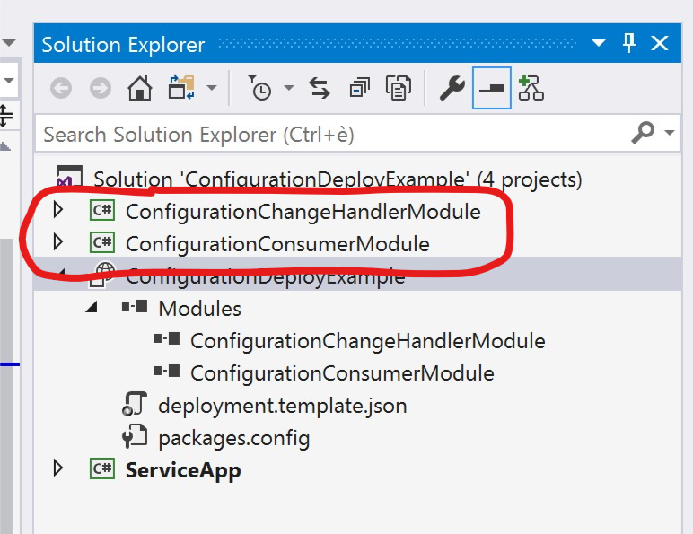
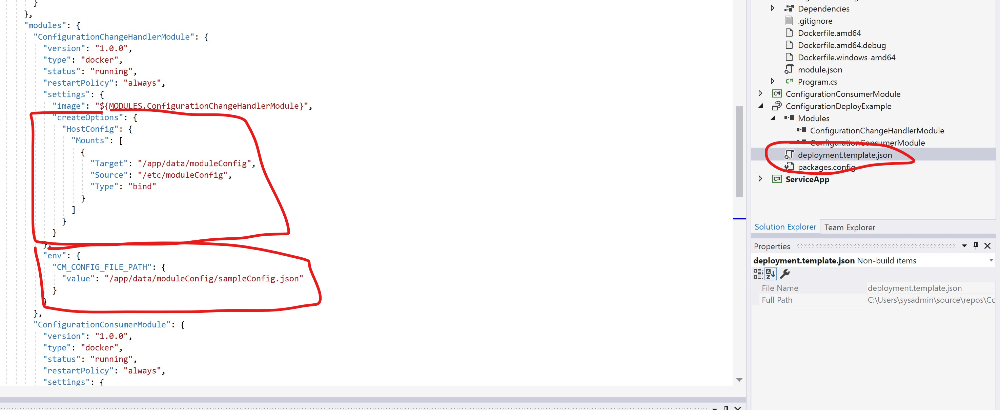
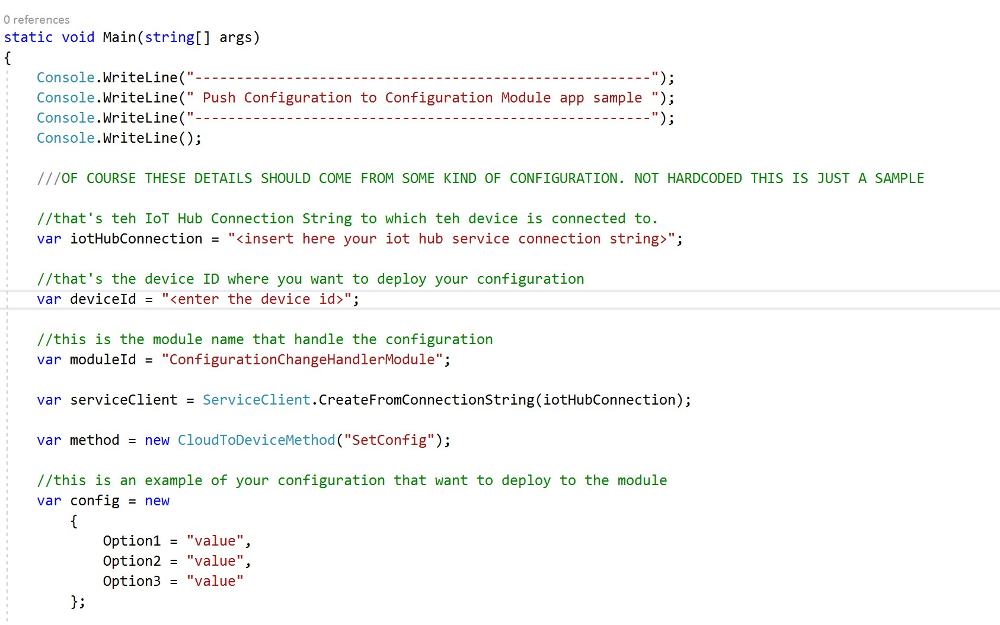

iot-edge-config-deploy
======================

In this sample I would show how to create an IoT Edge Module that will listen
for a Direct Method call and save the content of the DM call into a file
(specified as Environment Variable).

This approach is useful when you have to rely on a container for which you do not
control the source code (or for which you do not want to change the code) that
expect a configuration file (in this example in JSON format but you can quite
easily change the code in order to deploy free text as soon as it is provided as
part of the Direct Meted JSON document) and you want to push the configuration
from IoT Hub

I’ve built these project following the how-to guide from this link:

https://docs.microsoft.com/en-gb/azure/iot-edge/how-to-visual-studio-develop-csharp-module

Please read carefully that document. You should modify some of the references to
your Docker Registry before being able to use this sample.

Sample Modules
--------------

Here is the two IoT Edge Modules:

### ConfigurationChangeHandlerModule

It is the module that actually register for a Direct Method call and will save
the content into the file mounted into the binded folder.

To mount folders and inject environment variable (for the actual file path) I’ve
modified the “deployment.template.json” file.

### ConfigurationConsumerModule

Just read the configuration file content from the file path that indicated by an
environment variable.  
The file is under the mounted folder path.

### Sharing files between containers

Then following the guide linked above you will be able to push the modules into
your Docker Registry and pull into your IoT Edge device easly.

In this example I’m sharing a file under the /etc folder in the host.

You can leverage even Docker volume if you do not want to access easly the
configuration file directly from the host running IoT Edge runtime.

Sample App
----------

A sample application that calls the Direct Method is included in the solution.

You need to enter your iot hub connection string and the device id to which send
the configuration:

Disclaimer
----------

This sample is provided as it is. It is not intended as production grade code.  
Feel free to take this code and change for your own specific use case and do not forget to send me a feedback 
at 

algorni@microsoft.com or here in git hub!
